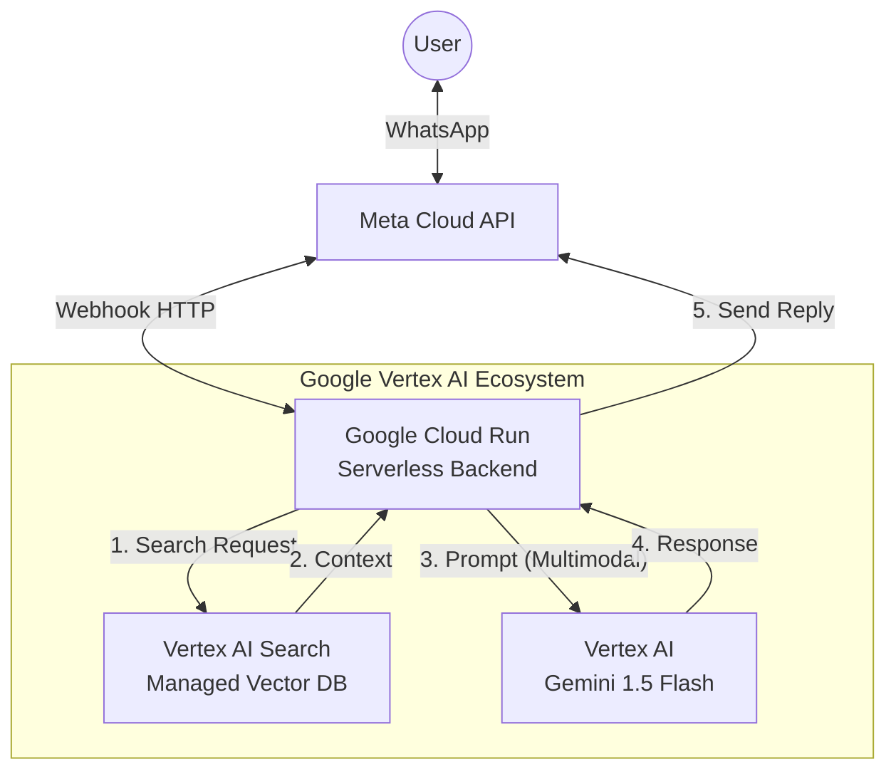

# Solution Architecture: Enterprise / Google Cloud (Gemini)

This document outlines the architecture, technology stack, and operational costs if migrating to an **Enterprise Google Cloud** solution using Gemini.

## 1. Solution Diagram

## 2. Technology Components

| Component | Technology | Purpose |
| :--- | :--- | :--- |
| **Interface** | WhatsApp (Meta Cloud API) | User chat interface. |
| **Backend** | Google Cloud Run | Auto-scaling serverless container (Python/Go/Node). |
| **LLM (Brain)** | **Gemini 1.5 Flash** | Google's cost-efficient, high-speed model. |
| **Knowledge Base** | **Vertex AI Agent Builder** | Managed RAG service (Upload PDFs -> Auto-index). |
| **Storage** | Google Cloud Storage (GCS) | Storing raw PDF files. |

## 3. Operational Costing (Monthly)

### **Scenario A: Prototype / Low Volume (< 1,000 users/mo)**

| Item | Cost | Notes |
| :--- | :--- | :--- |
| **Cloud Run** | **~$0.00** | Free tier covers 2M requests/mo (ample for prototype). |
| **Gemini 1.5 Flash** | **~$0.02** | ~$0.35 per 1M tokens (Extremely cheap). |
| **Vertex AI Search** | **~$0.00** | **CAUTION**: Standard edition has a base cost, but trial credits ($300) cover initially. *See Note below.* |
| **WhatsApp API** | **$0.00** | First 1,000 conversations free. |
| **Total** | **~$0-5.00 / mo** | Mostly free, but Vertex Search can incur costs if not careful. |

---

### **Scenario B: Commercial Scale (Active Daily Usage)**

Using **Gemini 1.5 Flash** (highly optimized for cost):

| Item | Service | Est. Cost |
| :--- | :--- | :--- |
| **Backend** | Cloud Run (CPU/Memory) | ~$10.00 / mo (Auto-scales with traffic) |
| **LLM** | Gemini 1.5 Flash API | ~$5.00 / mo (Assuming 1M input tokens/day) |
| **Knowledge Base** | Vertex AI Vector Search | ~$20.00 - $50.00 / mo (Base node hours) |
| **WhatsApp** | Meta Conversations | ~$40.00 (varies by country/usage) |
| **Total** | | **~$80.00 - $100.00 / mo** |

## 4. Pros & Cons (vs Render/Groq)

**✅ Pros:**
*   **No "Cold Starts"**: Cloud Run scales to zero but wakes up much faster (ms vs sec).
*   **Infinite Memory**: Can ingest thousands of PDFs without crashing.
*   **Managed Management**: Vertex AI handles the "Ingestion" automatically. You just upload a file to UI, no running `ingest.py`.
*   **Multimodal**: User can send an **Image** of a form, and Gemini can read it.

**❌ Cons:**
*   **Complex Setup**: Requires GCP IAM, Service Accounts, Cloud Billing setup.
*   **Base Costs**: Some Vertex services have a minimum hourly cost even if idle.
*   **Overkill**: Might be too complex for a simple NGO bot.

## 5. Recommendation

For the **Initial Prototype**, keep the **Render + Groq** stack. It is zero risk and zero maintenance.

Move to **Google Cloud** only if:
1.  The NGO has >100 PDFs.
2.  You need 99.99% uptime guarantees.
3.  You have a budget for cloud credits.
