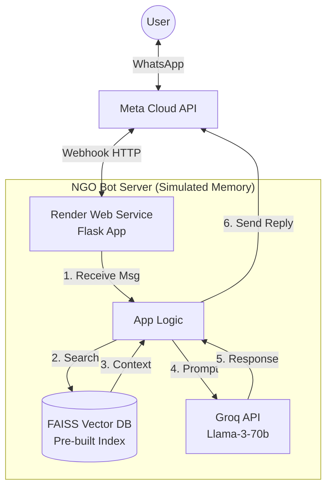

# Solution Architecture: Open Source / Zero-Cost Stack

This document outlines the architecture, technology stack, and operational costs for the **current implementation** using Render, Groq, and Open Source tools.

## 1. Solution Diagram

## 2. Technology Components

| Component | Technology | Purpose |
| :--- | :--- | :--- |
| **Interface** | WhatsApp (Meta Cloud API) | User chat interface. |
| **Backend** | Python (Flask + Gunicorn) | Webhook server logic. |
| **Hosting** | Render.com (Free Tier) | Hosts the server code. |
| **Database (RAG)** | FAISS (Facebook AI Similarity Search) | Stores PDF knowledge locally (Requires ~50MB RAM). |
| **LLM (Brain)** | Groq (Llama-3.3-70b) | Generates natural human responses (Free/Beta tier). |
| **Embeddings** | HuggingFace (`all-MiniLM-L6-v2`) | Converts PDF text to searchable numbers. |

## 3. Operational Costing (Monthly)

### **Scenario A: Prototype / Low Volume (< 1,000 users/mo)**

| Item | Cost | Notes |
| :--- | :--- | :--- |
| **Hosting (Render)** | **$0.00** | Free tier (spins down after 15 mins inactivity). |
| **LLM (Groq)** | **$0.00** | Currently free during beta (or very low cost). |
| **WhatsApp API** | **$0.00** | First **1,000 service conversations** per month are FREE. |
| **Database** | **$0.00** | Embedded in app (No external SQL/Vector DB cost). |
| **Total** | **$0.00 / mo** | **Perfect for NGO launch.** |

---

### **Scenario B: Scaled Production (10,000 users/mo)**

If the NGO grows significantly, these are the expected upgrade costs to ensure reliability (no sleeping server) and higher limits.

| Item | Service | Est. Cost |
| :--- | :--- | :--- |
| **Hosting** | Render "Starter" Plan | $7.00 / mo |
| **LLM** | Groq (Standard Pricing) | ~$5.00 / mo (variable based on usage) |
| **WhatsApp** | Meta Conversations | ~$40.00 (approx ₹0.30 - ₹0.80 per conversation after free tier) |
| **Total** | | **~$52.00 / mo** |

## 4. Pros & Cons

**✅ Pros:**
*   **Zero Initial Investment**: Launch today without a credit card.
*   **Privacy**: Data stays in your control (mostly).
*   **Speed**: Groq LPU is extremely fast.

**❌ Cons:**
*   **Cold Starts**: The free server takes ~50 seconds to wake up if no one uses it.
*   **Memory Limit**: Render Free gives 500MB RAM. Large PDFs (>500 pages) might crash it.
*   **Manual Updates**: updating PDFs requires re-deploying code.
